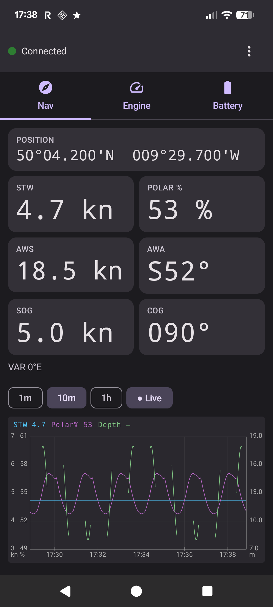
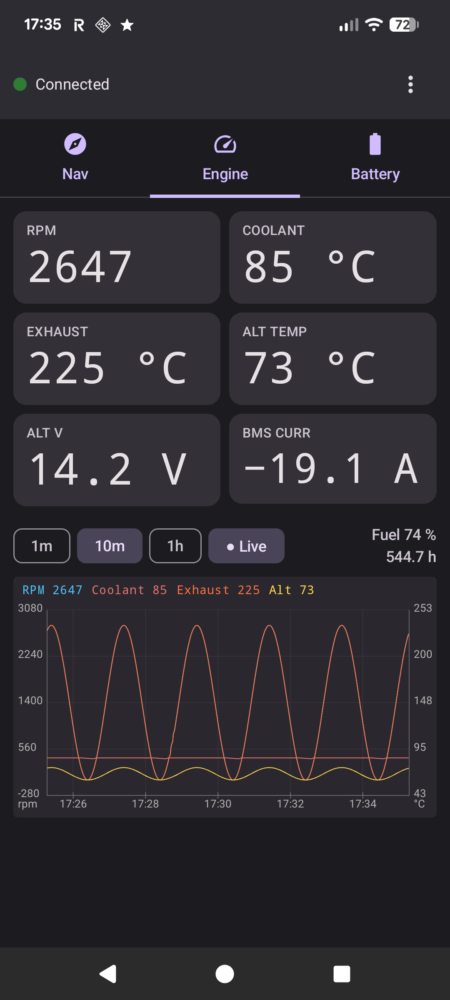
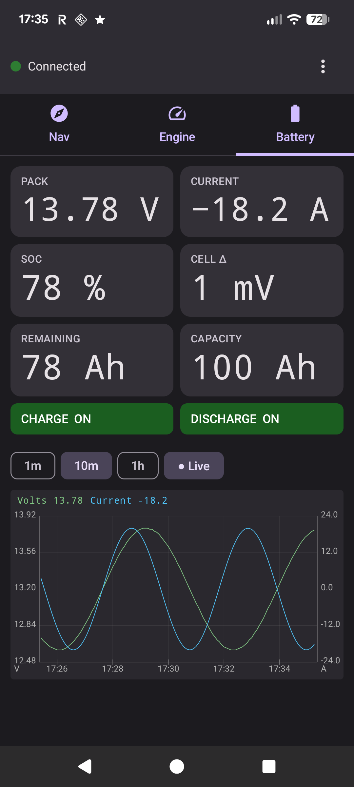
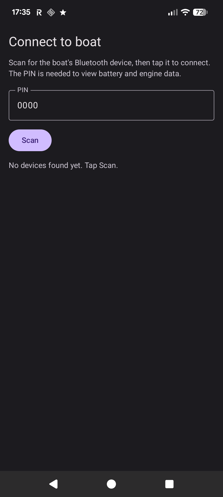

# NMEA Monitor

A quick-glance Android app for viewing a boat's live instrument data over
Bluetooth Low Energy. Open it, auto-connect to the boat's BLE device, and
read navigation, engine, and battery data as large high-contrast tiles with
scrollable time-series graphs. Built for a Pixel 7a.

It is a deliberately slimmed-down sibling of
[`nmeabridgeapp`](../nmeabridgeapp): same BLE transport and decoders, but no
TCP server, no polar editor, and a smaller-screen UI. `package uk.co.tfd.nmeamonitor`.

## Screens

Three swipeable tabs plus a first-run device picker. All values fall back to
`---` when a stream goes stale, and each graph pans through recorded history
with 1m / 10m / 1h window presets and a Live button.

### Navigation

Position, STW, live Polar %, apparent wind (AWS / AWA), and SOG / COG. The
graph plots STW, Polar %, and depth over time on three independent Y axes
(STW knots and Polar % on the left, depth metres on the right).



### Engine

RPM, coolant, exhaust, alternator temperature, alternator voltage, and BMS
current, with a fault-alarm banner. The graph plots RPM (left axis) plus
coolant / exhaust / alternator temperature (right °C axis); fuel % and engine
hours sit beside the window controls.



### Battery

Pack voltage, current, state of charge, cell balance (max−min spread), and
remaining / full capacity, with charge / discharge FET status chips. The
graph plots pack voltage (left axis) against pack current (right axis).



### Connect / change device

On first launch (or via the ⋮ menu → **Change device**), scan for the boat's
BLE device and tap to connect. The PIN unlocks the battery and engine data
(the "BoatWatch" auth handshake). The chosen device and PIN are remembered,
so subsequent launches auto-connect with no scan.



## How it works

- **BLE.** A foreground service owns a single `BleNmeaSource` GATT client for
  the app's lifetime, holding a partial wake lock so the link survives the
  screen turning off. Nav (FF01) and engine (FF02) ride the open FF00 service;
  battery (AA03) is on the BoatWatch AA00 service and requires PIN auth.
  Decoded state is exposed as `StateFlow`s and combined into a `MonitorState`.
- **History.** Raw nav / engine / BMS frames are appended to per-day binary
  logs under the app's external files dir
  (`Android/data/uk.co.tfd.nmeamonitor/files/history/`). `FrameLog` pads
  sentinel frames for silent seconds, so gaps show as breaks in the graph
  lines rather than held values. The graphs read a disk window via
  `HistoryDataSource`, so history survives the service being killed or a
  reboot.
- **Polar %.** Computed on the phone from the received apparent wind + STW
  against a bundled boat polar (`assets/polars/pogo1250.csv`) — there is no
  polar data over BLE. Swap that CSV to match your boat.
- **UI.** 100% Jetpack Compose (Material 3, dark theme). The three graphs
  share one `MultiSeriesChart` (up to three Y axes) wrapped by
  `ScrollableHistoryChart` (window presets, Live, pan, and tap-to-crosshair).

## Build & install

Requires Android SDK and a JDK 17. The Gradle wrapper pins Gradle 8.9;
AGP 8.7.3 / Kotlin 2.0.21 / compileSdk 35 / minSdk 26.

```sh
# JAVA_HOME must point at a valid JDK 17 (not the stock /Library/Java/Home).
export JAVA_HOME=/Library/Java/JavaVirtualMachines/temurin-17.jdk/Contents/Home
./gradlew assembleDebug
adb install -r app/build/outputs/apk/debug/app-debug.apk
```

On first run, grant Bluetooth (and notification) permissions, tap **Scan**,
pick the boat's device, enter the PIN, and connect.

## Testing without the boat

The reference project ships a Python BLE peripheral that emulates the same
transport (nav, engine, battery, and the PIN auth handshake):

```sh
cd ../nmeabridgeapp/simulator
uv run nmea_ble_sim.py --pin 0000
```

Run it on a Mac with Bluetooth, then scan and connect from the app with PIN
`0000` to exercise all three screens with synthetic live data. (The
screenshots above were captured against this simulator; its dry-exhaust and
constant-STW values are why some traces look flat or wide-ranged.)
